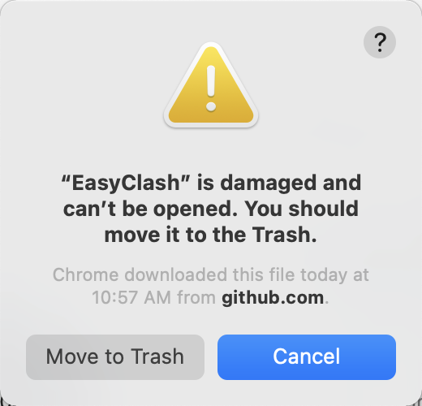

# EasyClash

A configuration manager app about [clash](https://github.com/Dreamacro/clash).

Support: `Macos Intel`, `Macos M1`, ~`Win`~  [Donwload EasyClash](https://github.com/daodao97/EasyClash/releases)

## Preview


## Add ProxyProvider


## QA



```shell
sudo xattr -r -d com.apple.quarantine /Applications/EasyClash.app
```

```shell
# 1
sudo spctl --master-disable

# 2
系统偏好设置 > 安全性与隐私 > 任何来源
```